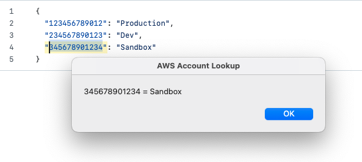

# AWSAccountLookup

by Tim Mabbott

This is a super simple Automator workflow to add a quick AWS account lookup action to a key-combo.

## Steps to install

- Download this repo
- Install the workflow:
  - Honestly, you shouldn't do this without examining the workflow in Automator (unless you know me, and trust me)
  - Double click the "AWS Account Lookup.workflow" and Automator will prompt to install it, or
  - Move it to ~/Library/Services/
- Install a json file with your account mappings to ~/.aws/accountLookup.json
  - see [sample/accountLookup.json](sample/accountLookup.json) for reference.
- Map a key combo to the workflow.
  - System Settings->Keyboard->Keyboard Shortcuts->Services->Text->AWS Account Lookup
  - double click on "none" and enter your combo.  I use cmd-shift-/

## To use

- Highlight an AWS account number anywhere (mail, terminal, wherever)
- Trigger your key-combo
- Alternatively you can Ctrl-Click-(on the highlighted number)->Services->AWS Account Lookup

You should see something like this:

### How do I create the accountLookup.json file?

There is a script in the scripts directory that will produce a file for you.  It expects a .csv file with column headers of "Account ID" and "Name" (this is what is produced if you do an export from your AWS Org account).

## License
This project is licensed under the MIT License - see the [LICENSE](LICENSE) file for details.

## Contributing/Feedback

Coming soon.

